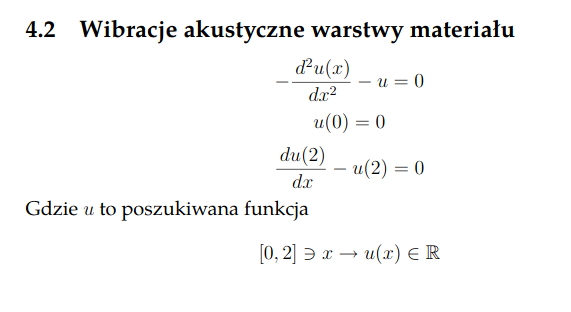

# differential-equation

Repo zawiera rozwiązanie metodą elementów skończonych następujące równanie różniczkowe 

(a(x)u′(x))′+b(x)u′(x) +c(x)u(x) =f(x)

Dokładnie policzone równanie jest podane poniżej.

